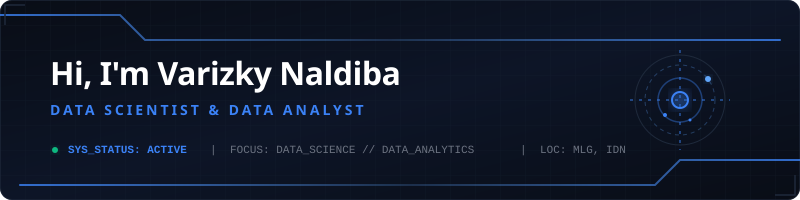

  

## 👤 About Me

I am an Informatics student specializing in **Data Science**, **Machine Learning**, and **Data Analytics**. I love translating complex, unstructured data into actionable insights and designing predictive models that solve real-world problems. 

## 🛠️ Tech Stack

### 📊 Data Science & Machine Learning

### 🗄️ Analytics & GIS

### 🌐 Web & IoT Systems

---

## 📈 GitHub Stats

  <table border="0" cellspacing="0" cellpadding="0">
    <tr>
      <td align="center" width="50%">
        
      </td>
      <td align="center" width="50%">
        
      </td>
    </tr>
    <tr>
      <td colspan="2" align="center">
         
        
      </td>
    </tr>
  </table>

### 📅 Activity Graph

  

---

## 🤝 Connect with Me

---

  
Thanks for visiting! Feel free to explore my repositories or reach out for collaboration.

